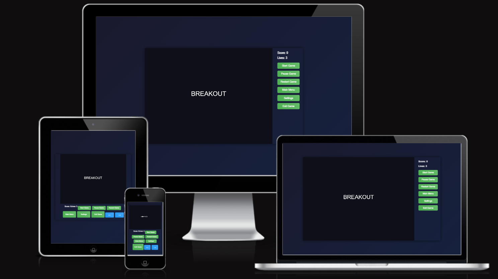

# 🚀 BREAKOUT BREAKS GAME

 ## 🎮 Game Overview
 Breakout-Break is a modern take on the classic Breakout game, built using HTML5 Canvas and JavaScript. The game features a paddle controlled by the player to bounce a ball and break bricks arranged in a grid. Enhanced with visual effects, power-ups, and sound, it offers an engaging and dynamic gaming experience.
 The site can be accessed through the [link](https://ebuka-martins.github.io/breakout-breaks/)

 

 ## 🎮Features
 - **Gameplay Mechanics:** Control a paddle to bounce a ball and destroy bricks. Each brick hit increases the score, with the goal of clearing all bricks to win.
- **Visual Effects:**
  - Dynamic gradient background that shifts colors over time.
  - Animated paddle scaling and glowing effects.
  - Ball trail effect with fading particles.
  - Particle explosions when bricks are destroyed or the ball hits walls/paddle.
- **Power-Ups:**  
  - **Expand:** Increases paddle size for easier ball catching.
  - **Speed:** Increases ball speed for added challenge.
  - **Life:** Grants an extra life to continue playing.
- **Sound:** Background music ``(the_deep.mp3)`` with toggleable sound settings. Audio is managed with Web Audio API for compatibility.  
- **Control:** 
  - **Keyboard:** Left/Right arrow keys for paddle movement, Escape key to pause.
  - **Mouse:** Move the paddle by hovering the mouse across the canvas.
  - **Touch:** Supports touch controls for mobile devices with on-screen directional buttons.
- **Game States:** Includes main menu, pause menu, settings menu, game over, and win screens.
- **Responsive Design:** Canvas size is 800x600 pixels, with paddle and ball sizes scaled appropriately.

## How to Play
1. **Start the Game:** Click the "Start Game" button from the main menu.
2. **Control the Paddle:** Use arrow keys, mouse movement, or touch buttons to move the paddle left and right.
3. **Objective:** Bounce the ball to break all bricks. Collect power-ups for bonuses.
4. **Lives and Scoring:** Start with 3 lives. Each brick is worth 10 points. Losing the ball costs a life.
5. **Pause Menu:** Press Escape or the pause button to access options like resume, restart, settings, or main menu.
6. **Settings:** Toggle sound on/off from the settings menu.
7. **Winning/Losing:** Clear all bricks to win or lose all lives for a game over.

## Technical Details
- **Canvas:** Uses a 2D canvas context for rendering.
- **Animation:** Utilizes requestAnimationFrame for smooth 60 FPS gameplay.
- **Collision Detection:** Precise ball-brick and ball-paddle collision handling.
- **Power-Ups:** Spawn with a 20% chance upon brick destruction, with visual spinning effects.
- **Particles:** Circle and square particles with rotation and fading effects for visual feedback.
- **Audio:** Background music loops with error handling and audio context unlocking for mobile compatibility.

## Controls
- **Keyboard:** 
  - Left Arrow: Move paddle left
  - Right Arrow: Move paddle right
  - Escape: Pause game
- **Mouse:** Move cursor horizontally to position the paddle
- **Touch:** Use on-screen left/right buttons for mobile control

## Dependencies
- No external libraries required; pure JavaScript and HTML5.
- Audio file ``(the_deep.mp3)`` required for background music.

## Notes
- The game includes error handling for audio loading and playback issues.
- Touch controls are optimized to prevent conflicts with mouse inputs on hybrid devices.
- Power-ups and particle effects add replayability and visual appeal.

